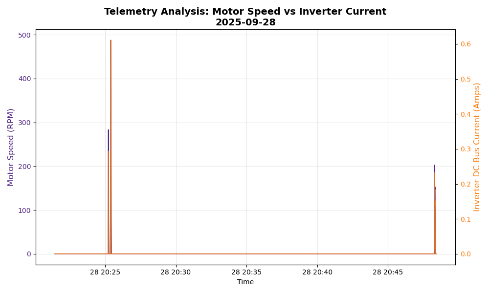

# End-to-End Analysis Example

This guide walks through a complete analysis session, from connecting to the database to discovering and visualizing results.

> **Note:** You can find the [source code for this example here](https://github.com/Western-Formula-Racing/wfr-telemetry/blob/main/examples/end_to_end.py).

---

## 1. Setup & Connection

First, we import the necessary libraries and configure our connection.

```python
import slicks as wfr
import matplotlib.pyplot as plt
from datetime import datetime
import pandas as pd

# The package auto-loads credentials from environment variables or defaults.
print("Connecting to Slicks Telemetry Database...")
```

**Output:**
```text
Connecting to Slicks Telemetry Database...
```

---

## 2. Discovering Sensors

Before fetching data, we need to know exactly what sensors were recording during our test session. We'll scan a specific window to see the available signals.

```python
start_time = datetime(2025, 9, 28, 20, 20, 0)
end_time   = datetime(2025, 9, 28, 21, 0, 0)

print(f"Scanning for sensors between {start_time} and {end_time}...")
available_sensors = wfr.discover_sensors(start_time, end_time)

# Filter for Inverter (INV) related sensors to narrow our search
inv_sensors = [s for s in available_sensors if s.startswith("INV_")]
print(f"Found {len(inv_sensors)} Inverter sensors. Examples: {inv_sensors[:5]}")
```

**Output:**
```text
Scanning for sensors between 2025-09-28 20:20:00 and 2025-09-28 21:00:00...
Discovering sensors from 2025-09-28 20:20:00 to 2025-09-28 21:00:00...
Discovery Complete. Found 342 unique sensors.
Found 91 Inverter sensors. Examples: ['INV_Analog_Input_1', 'INV_Analog_Input_2', 'INV_Analog_Input_3', 'INV_Analog_Input_4', 'INV_Analog_Input_5']
```

---

## 3. Fetching Data

Once we've identified our target signals (in this case, `INV_Motor_Speed` and `INV_DC_Bus_Current`), we fetch the processed data.

```python
target_signals = ["INV_Motor_Speed", "INV_DC_Bus_Current"]

print(f"Fetching data for: {target_signals}...")

# Fetch 1-second resampled data. 
# We disable filter_movement to capture the full session including startup.
df = wfr.fetch_telemetry(start_time, end_time, signals=target_signals, filter_movement=False)

if df is not None:
    print(f"Successfully loaded {len(df)} data points.")
    print(df.head())
```

**Output:**
```text
Fetching data for: ['INV_Motor_Speed', 'INV_DC_Bus_Current']...
Executing query for range: 2025-09-28 20:20:00 to 2025-09-28 21:00:00...
Fetched 117 rows.
Successfully loaded 117 data points.
signalName           INV_DC_Bus_Current  INV_Motor_Speed
time                                                    
2025-09-28 20:21:27                 0.0              0.0
2025-09-28 20:21:28                 0.0              0.0
2025-09-28 20:21:29                 0.0              0.0
2025-09-28 20:21:30                 0.0              0.0
2025-09-28 20:21:31                 0.0              0.0
```

---

## 4. Visualization

Now we create a dual-axis plot to compare the two signals. We'll use the team's official purple color (`#4F2683`) for the primary axis.

```python
print("Generating plot...")
wfr_purple = '#4F2683'

fig, ax1 = plt.subplots(figsize=(10, 6))

# Plot Motor Speed on Left Axis
color_speed = wfr_purple
ax1.set_xlabel('Time')
ax1.set_ylabel('Motor Speed (RPM)', color=color_speed, fontsize=12)
ax1.plot(df.index, df['INV_Motor_Speed'], color=color_speed, label='Motor Speed', linewidth=1.2)
ax1.tick_params(axis='y', labelcolor=color_speed)
ax1.grid(True, alpha=0.3)

# Create a second y-axis for Current
ax2 = ax1.twinx()
color_current = 'tab:orange'
ax2.set_ylabel('Inverter DC Bus Current (Amps)', color=color_current, fontsize=12)
ax2.plot(df.index, df['INV_DC_Bus_Current'], color=color_current, label='DC Current', linewidth=1.2, alpha=0.8)
ax2.tick_params(axis='y', labelcolor=color_current)

plt.title(f'Telemetry Analysis: Motor Speed vs Inverter Current\n{start_time.date()}', fontsize=14, fontweight='bold')
fig.tight_layout()
plt.show()
```

**Output:**
```text
Generating plot...
```



*The plot allows you to visually correlate speed changes with DC current spikes during the test run.*
